# Student Registration System

**Course:** ITST 302 – Client-Server Technologies
**Activity:** Week 4 Laboratory Activity – Mini Project 03 (MP03)
**Stack:** Laravel · MySQL · Blade · Tailwind CSS

---

## 1. Project Title

Student Registration System — Laravel Forms, Validation, and File Upload

## 2. Introduction

The College of Information Technology is transitioning from paper-based student registration to a digital registration system. This project implements the registration module of that system: a web form that allows students to register online while ensuring that submitted information is valid, secure, and stored correctly.

A student registration system is a common building block of enterprise information systems — universities, hospitals, banks, and government agencies all rely on secure, validated data-entry systems to collect and manage user information. Getting this right matters for two reasons. First, **data validation** protects the integrity of the database: without it, incomplete, duplicate, or malformed records accumulate and become expensive to clean up later. Second, registration modules are almost always the **first point of contact** between a user and an enterprise system, so their reliability and clarity set the tone for the rest of the application.

This activity focuses specifically on Laravel's approach to handling client requests, validating input on the server, uploading files securely, and giving the user clear feedback — skills that will be reused directly in the Enterprise Laravel E-Commerce Project later in the semester.

## 3. Objectives

By completing this activity, the following learning objectives were accomplished:

- Developed HTML forms using Blade templates.
- Processed client requests using a Laravel controller (`StudentController`).
- Implemented server-side validation using a dedicated `FormRequest` class.
- Displayed flash messages for both successful and failed operations.
- Uploaded and securely stored a file (profile picture) using Laravel Storage.
- Designed and implemented a relational database table (`students`) via migrations.
- Documented the development process in this Markdown README.
- Applied Git version control with a structured, meaningful commit history.

## 4. Laravel Request Lifecycle

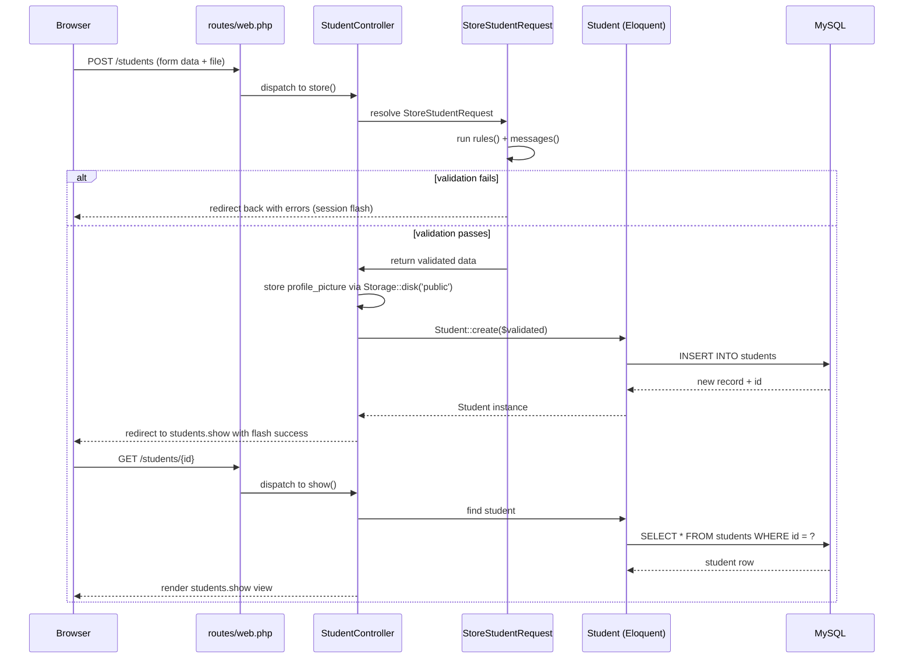

**Narrative:**
1. **Browser** — the user submits the registration form as `multipart/form-data` (required for the file upload).
2. **Route** — `routes/web.php` matches `POST /students` and dispatches to `StudentController@store`.
3. **Controller** — Laravel resolves `StoreStudentRequest` *before* the controller body runs.
4. **Validation** — if any rule fails, the request never reaches the controller logic; the user is redirected back with `$errors` and `old()` input preserved. If it passes, validated data is returned.
5. **Model** — `Student::create()` mass-assigns the validated fields (protected by `$fillable`) and the image is stored via `Storage::disk('public')`.
6. **Database** — MySQL commits the row and returns the new `id`.
7. **Response** — the controller redirects to the profile page with a flash `success` message, and the student's data and photo are displayed.

## 5. Validation Rules

| Field | Rule(s) | Why it matters |
|---|---|---|
| `student_id` | `required`, `unique` | Prevents duplicate registrations and guarantees each student has one canonical record. |
| `first_name` / `last_name` | `required`, `string`, `max:100` | Ensures the record is identifiable; a length cap prevents abuse of the column and database bloat. |
| `middle_name` | `nullable` | Optional in real student records — not everyone has one, so it shouldn't block submission. |
| `email` | `required`, `email`, `unique` | Guarantees a working contact channel and prevents one student from registering twice under different IDs. |
| `mobile_number` | `required`, `numeric` | Non-numeric input (letters, symbols) would break any future SMS/contact integration. |
| `date_of_birth` | `required`, `date`, `before:today` | Rejects malformed dates and impossible values (e.g., future birthdates). |
| `gender` | `required`, `in:male,female,other` | Restricts input to a controlled set of values rather than free text, keeping the column queryable. |
| `program` / `year_level` | `required` | Core to identifying which curriculum and cohort the student belongs to. |
| `address` | `required` | Needed for institutional correspondence. |
| `profile_picture` | `required`, `image`, `mimes:jpg,jpeg,png`, `max:2048` | The **most security-critical rule**: `image` + `mimes` prevents disguised executables (e.g., a `.php` file renamed to `.jpg`) from being uploaded, and `max:2048` (2MB) protects server storage from abuse. |

Server-side validation is enforced regardless of what the client sends, because client-side (HTML5/JS) validation can always be bypassed — via browser dev tools, disabling JavaScript, or sending a raw HTTP request directly to the endpoint. The server is the only place validation can be trusted.

## 6. Database Design

### Entity Relationship Diagram (ERD)

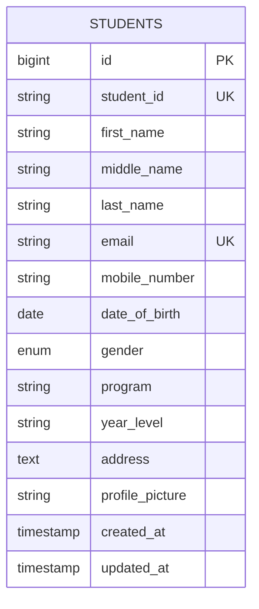

### Table Structure

| Column | Type | Constraints |
|---|---|---|
| id | BIGINT | Primary Key, Auto Increment |
| student_id | VARCHAR(50) | Unique, Not Null |
| first_name | VARCHAR(100) | Not Null |
| middle_name | VARCHAR(100) | Nullable |
| last_name | VARCHAR(100) | Not Null |
| email | VARCHAR(255) | Unique, Not Null |
| mobile_number | VARCHAR(20) | Not Null |
| date_of_birth | DATE | Not Null |
| gender | ENUM('male','female','other') | Not Null |
| program | VARCHAR(150) | Not Null |
| year_level | VARCHAR(50) | Not Null |
| address | TEXT | Not Null |
| profile_picture | VARCHAR(255) | Not Null (stores file path only) |
| created_at / updated_at | TIMESTAMP | Auto-managed by Eloquent |

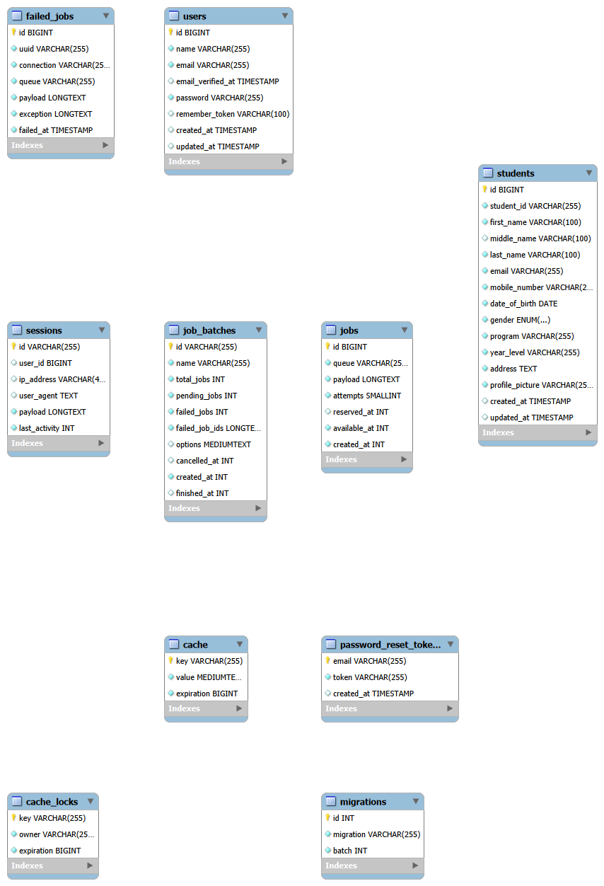

## 7. Flowchart

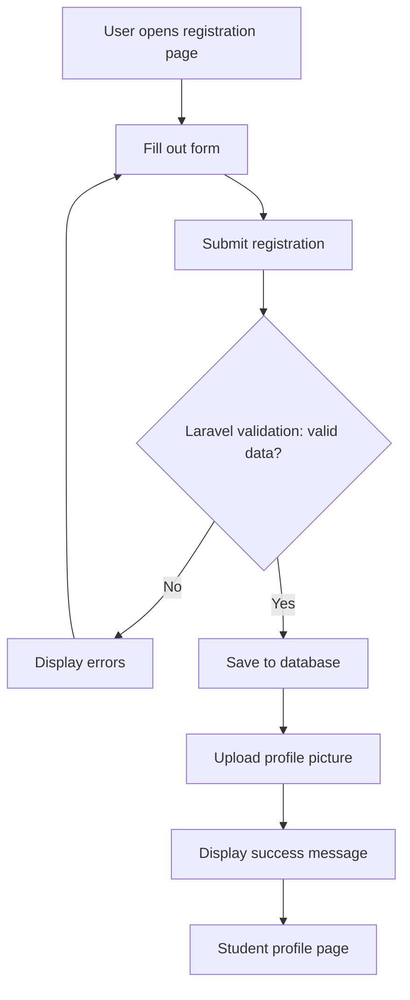

## 8. Screenshots

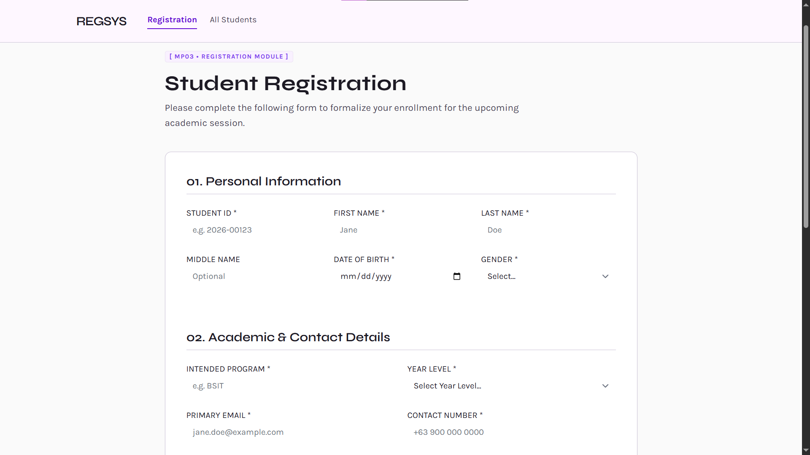
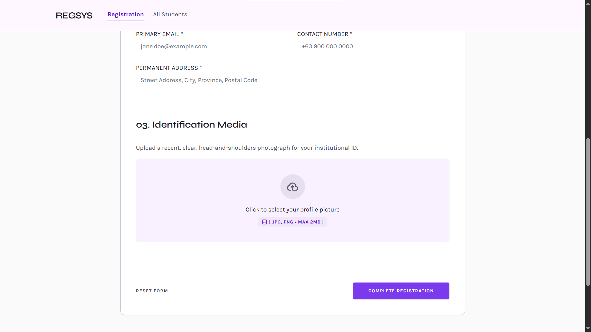
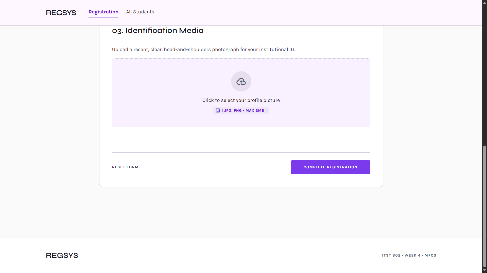
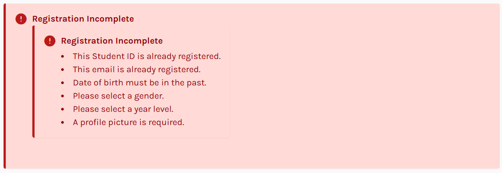
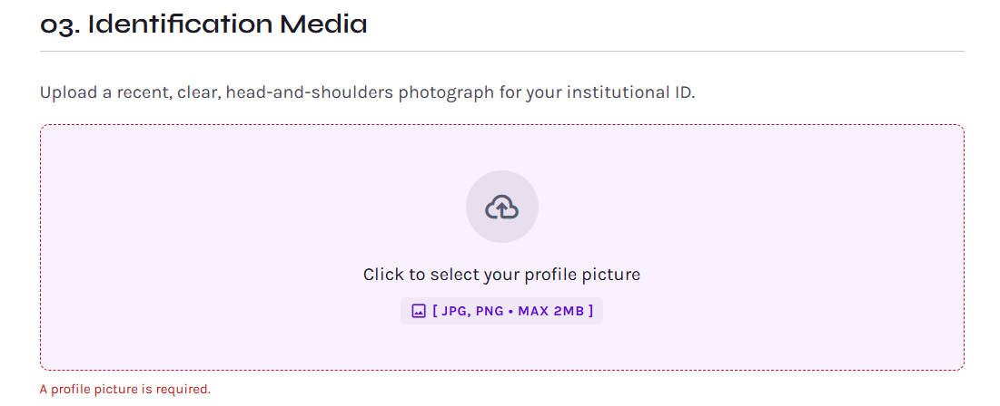

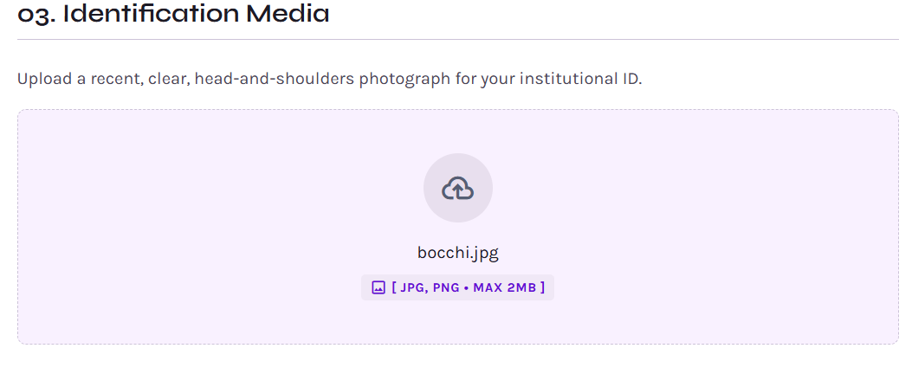
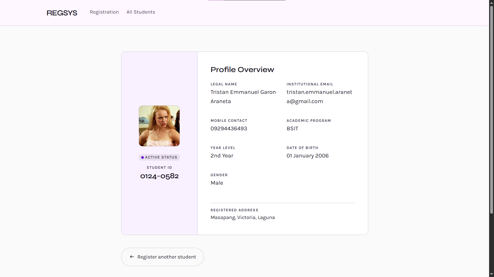

## 9. Problems Encountered

1. Validation Errors Not Displaying / Form Inputs Wiping:

During initial testing, when validation failed due to missing fields, submitted form inputs cleared entirely and field error messages were missing, causing poor user feedback.

2. Uploaded Profile Image Returning 404 Broken Link:

After successfully writing the student record to MySQL, the uploaded avatar displayed as a broken image icon on the student profile page (/students/{id}).

3. Database Storage Link Missing / Target Directory Access Failure:

Attempting to view uploaded files resulted in path resolution errors because the local storage directory was isolated from the public web root.

## 10. Solutions

1. Implemented @error Directives & old() Input Helper:

Updated Blade input elements with old('field_name') attributes to retain user input across redirects, and wrapped fields in @error('field_name') directives to show inline Tailwind CSS alert styling.

2. Configured Storage::disk('public') & Asset Helpers:

Updated StudentController to store images via $request->file('profile_picture')->store('profiles', 'public') and formatted image display URLs in Blade using asset('storage/' . $student->profile_picture).

3. Executed php artisan storage:link Command:

Executed php artisan storage:link in the terminal to establish a symbolic link connecting storage/app/public to public/storage, allowing the browser to serve uploaded media files cleanly.

## 11. Reflection

Data validation and input processing constitute the foundation of secure web application engineering. In enterprise web development, user-submitted data represents both the core value of an application and its largest attack surface. Building the Student Registration System provided practical insight into handling incoming HTTP client requests, enforcing strict server-side validation rules, managing file uploads safely, and maintaining seamless user interaction through flash session messaging.

A major takeaway from this project is recognizing why server-side validation is strictly non-negotiable. While client-side validation built with HTML5 attributes or JavaScript improves user experience by providing instant interface feedback, it offers zero guaranteed security. Clients have complete control over their browser environments; malicious actors can easily bypass JavaScript, alter DOM field attributes, or craft custom HTTP POST requests using tools like Postman or curl. Server-side validation acts as the definitive gatekeeper, ensuring that malformed data, SQL injection payloads, or corrupted inputs are rejected before touching application logic or database storage.

Handling user-uploaded media highlighted the critical importance of file upload security. File uploads present severe security vectors if handled carelessly, such as remote code execution (RCE) via uploaded script files or denial-of-service (DoS) attacks through storage exhaustion. Enforcing strict validation rules—limiting file extensions (mimes:jpg,jpeg,png), validating MIME types (image), and imposing file size limits (max:2048)—guarantees that uploaded content remains harmless. Furthermore, storing images outside the web root or serving them strictly through symbolic links with hashed filenames ensures that users cannot overwrite system files or execute uploaded scripts directly on the web server.

In enterprise architecture, registration components serve as the primary gateway for identity management and data collection across domains such as higher education, healthcare, e-commerce, and financial technology. High-quality registration modules ensure data normalization upon entry—guaranteeing unique identifiers like Student IDs and contact emails—which prevents costly data cleaning and duplicate processing downstream. Completing this project reinforced how Laravel’s Model-View-Controller (MVC) pattern and built-in Request Lifecycle streamline secure form processing, creating a solid architectural blueprint for building scalable, data-driven web applications.

## 12. References

Laravel. (n.d.). Laravel 11.x documentation. https://laravel.com/docs

MySQL. (n.d.). MySQL 8.0 reference manual. https://dev.mysql.com/doc/

PHP Group. (n.d.). PHP documentation. https://www.php.net/manual/en/

Tailwind Labs. (n.d.). Tailwind CSS documentation. https://tailwindcss.com/docs

Author: Tristan Emmanuel G. Araneta

Course & Section: ITST 302 – BSIT 3B

Institution: Laguna State Polytechnic University

Submission: Week 4 Mini Project 03 (MP03)
